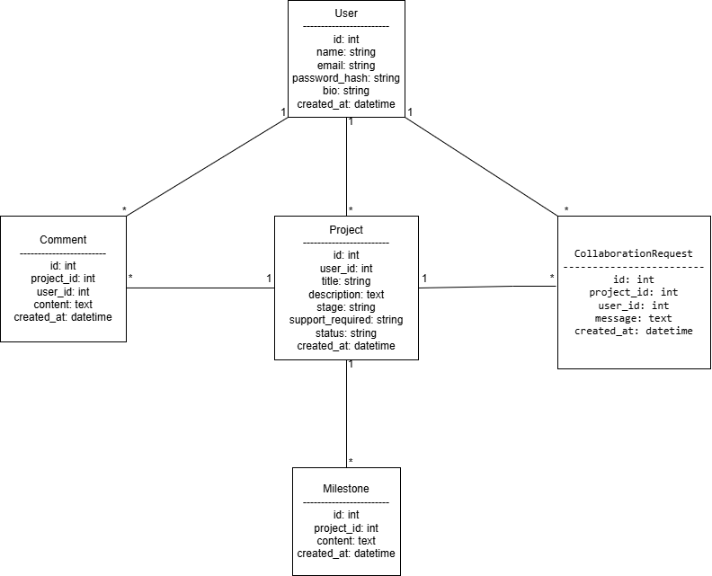

# MzansiBuilds

MzansiBuilds is a web application designed to help developers build in public by sharing projects, tracking progress, engaging with other developers, and celebrating completed work.

---

## Overview

The platform enables developers to create accounts, post projects they are working on, receive feedback and collaboration from others, track milestones, and appear on a Celebration Wall when their project is complete.

---

## Target Users

Developers who want to:
- Share what they are building with the community
- Get feedback and collaboration from other developers
- Track and document their building journey publicly
- Celebrate completed projects

---

## Tech Stack

| Layer | Technology |
|---|---|
| Backend | Python Flask |
| Database | SQLite with SQLAlchemy |
| Frontend | Flask Templates, HTML, CSS, JS |
| Auth | Flask-Login |
| Testing | pytest |
| Version Control | GitHub |

This stack was chosen for its simplicity, low overhead, and suitability for an MVP within a tight deadline.

---

## Design Theme

Green, white and black.

---

## Functional Requirements

The system must allow a developer to:
- Register and log into an account
- Create and manage a project entry
- Specify project stage and support required
- View other developers' projects in a feed
- Comment on projects
- Raise collaboration requests
- Add milestone updates to their projects
- Mark a project as completed
- Appear on the Celebration Wall once a project is completed

## Non-Functional Requirements

The system should:
- Be simple and easy to use
- Have clean and readable navigation
- Store user and project data securely
- Validate all inputs
- Be maintainable and easy to test
- Be deployable with minimal configuration

---

## MVP Scope

To manage time effectively and meet the assessment deadline, the project was scoped as a Minimum Viable Product. The MVP focuses on the essential user journey required by the brief:

- User registration and login
- Project creation and viewing
- Commenting and collaboration requests
- Progress milestone updates
- Project completion and Celebration Wall display

### Features intentionally excluded from MVP

To avoid overengineering and prioritise core functionality, the following were excluded from the first version:
- Real-time notifications
- Direct messaging
- Profile pictures and file uploads
- Advanced search and filtering
- Likes or reactions
- Admin dashboard
- Live coding sessions

---

## User Stories

- As a developer, I want to register an account so that I can use the platform
- As a developer, I want to log in so that I can access my projects
- As a developer, I want to create a project entry so that others can see what I am building
- As a developer, I want to specify the stage of my project and support needed so that I can get relevant collaboration
- As a developer, I want to view other developers' projects so that I can stay inspired and engage
- As a developer, I want to comment on projects so that I can share feedback
- As a developer, I want to raise a collaboration request so that I can offer support
- As a developer, I want to post milestones so that I can track my progress publicly
- As a developer, I want to mark my project as complete so that it appears on the Celebration Wall

---

## UML Diagram



---

## Entity Design

| Entity | Description |
|---|---|
| User | A registered developer on the platform |
| Project | A project created and owned by a developer |
| Comment | A comment left by a developer on a project |
| Milestone | A progress update added to a project |
| CollaborationRequest | A request by a developer to collaborate on a project |

### Relationships
- One User has many Projects
- One User has many Comments
- One User has many CollaborationRequests
- One Project has many Comments
- One Project has many Milestones
- One Project has many CollaborationRequests

---

## Development Phases

| Phase | Focus | Status |
|---|---|---|
| Phase 1 | Project setup, scaffold and database models | Complete |
| Phase 2 | User registration, login and auth tests | Complete |
| Phase 3 | Project creation, feed and feature tests | Complete |
| Phase 4 | Comments, collaboration requests and tests | Complete |
| Phase 5 | Milestones, Celebration Wall and tests | Complete |
| Phase 6 | Documentation, validation and security | Complete |
| Phase 7 | Stretch goals | Pending |

---

## Project Structure

```
mzansibuilds/
├── app/
│   ├── models/        # database models
│   ├── routes/        # HTTP route handlers
│   ├── services/      # business logic
│   ├── templates/     # HTML templates
│   └── static/        # CSS and JS
├── tests/             # pytest test files
├── config.py          # environment configuration
├── run.py             # application entry point
└── requirements.txt   # dependencies
```

---

## Security Considerations

- Passwords are hashed using Werkzeug's `generate_password_hash`
- All protected routes require authentication via Flask-Login
- Only project owners can add milestones or mark a project as complete
- Email format and password length are validated on registration
- Secret key is loaded from environment variables via `.env`
- `.env` is excluded from version control via `.gitignore`
- All form inputs are validated server-side before processing

---

## Setup Instructions

```bash
# Clone the repository
git clone https://github.com/HarmonyWM/mzansibuilds.git
cd mzansibuilds

# Create and activate virtual environment
python -m venv venv
venv\Scripts\activate

# Install dependencies
pip install -r requirements.txt

# Set up environment variables
copy .env.example .env

# Run the application
python run.py
```

---

## Running Tests

```bash
pytest
```

---

## Author

Waborena Harmony Madisha — Derivco Code Skills Challenge 2026
